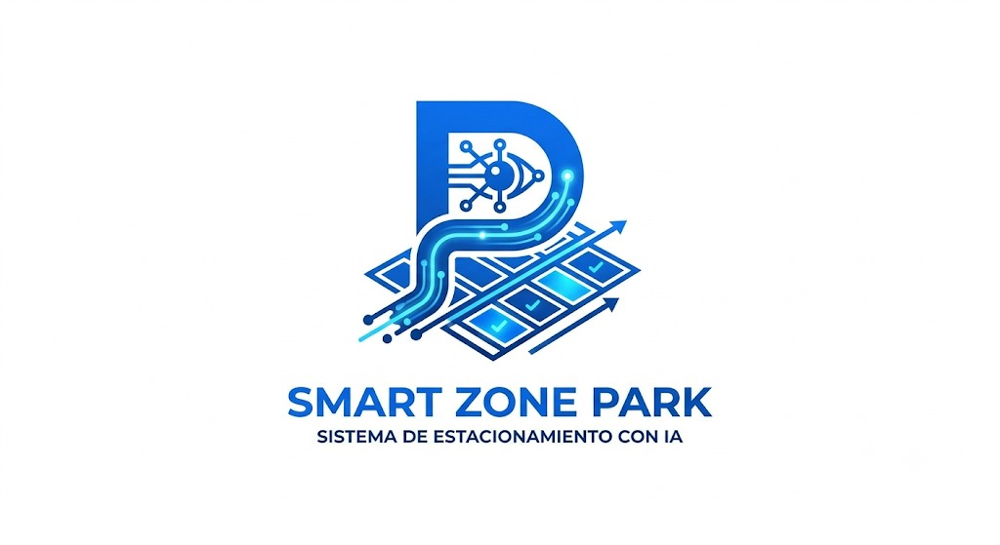

<div align="center">
  

  <h3 align="center">Intelligent Urban Parking Space Detection System</h3>

  <p align="center">
    A computer vision system to automate the monitoring and estimation of available parking spaces on public streets.
    <br />
    <br />
    <a href="#about-the-project"><strong>Explore the docs »</strong></a>
    <br />
    <br />
    <a href="#">View Demo</a>
    ·
    <a href="#">Report Bug</a>
    ·
    <a href="#">Request Feature</a>
  </p>
</div>

<!-- TABLE OF CONTENTS -->
<details>
  <summary>Table of Contents</summary>
  <ol>
    <li>
      <a href="#about-the-project">About The Project</a>
      <ul>
        <li><a href="#the-problem">The Problem</a></li>
      </ul>
    </li>
    <li><a href="#key-features">Key Features</a></li>
    <li><a href="#architecture">Architecture</a></li>
    <li><a href="#technical-challenges">Technical Challenges</a></li>

    <li><a href="#contact">Contact</a></li>
  </ol>
</details>

<br>

## About The Project

This project, developed by **DevStar**, consists of a computer vision system capable of analyzing footage from fixed cameras to identify urban elements (streets, sidewalks, vehicles, obstacles, garage entrances, etc.) and automatically estimating the number of vehicles that can be parked in a given area.

### The Problem

In many cities, drivers:
* Waste time looking for parking.
* Generate additional traffic while searching for spaces.
* Are unaware of the actual availability of parking spots.
* Lack automated monitoring for public street parking zones.

Currently, most intelligent parking systems operate exclusively in private parking lots with clearly defined spaces. This proposal aims to detect potential parking spaces on any street observed by a camera, democratizing access to smart parking data.

## Key Features

The initial MVP version is designed to provide the following capabilities:

* **Detection:** Accurately identifies streets, sidewalks, vehicles, motorcycles, and urban obstacles.
* **Calculation:** Computes the free distance between vehicles, usable available space, and estimates the number of vehicles that can fit.
* **Visualization:** Displays the processed image, highlighted detected spaces, estimated available spots, and real-time statistics.

## Architecture

The system follows a modular data pipeline architecture:

1. **IP Camera:** Captures real-time street footage.
2. **Python Processing:** Handles image ingestion and preprocessing.
3. **AI Model:** Performs object detection and semantic segmentation.
4. **Spatial Calculation Engine:** Computes distances and estimates parking capacity.
5. **API:** Serves processed data to client applications.
6. **Web Dashboard:** Visualizes the data and statistics for end-users.

## Technical Challenges

| Challenge | Description | Proposed Solution |
|-----------|-------------|-------------------|
| **Scene Understanding** | Identifying various urban elements accurately (cars, pedestrians, trees). | Semantic segmentation. |
| **Distance Measurement** | Camera perspective makes distant objects appear smaller. | Camera calibration, perspective transformation, and homography. |
| **Valid Spaces** | Differentiating between empty spaces and restricted areas (e.g., garage entrances). | Detection of urban restrictions (Phase 2). |
| **Environmental Conditions** | Handling intense sun, shade, night, rain, and occlusions. | Training with diverse datasets. |


## Configuración del Entorno (Setup)

Este proyecto cuenta con un entorno profesional, preparado para el desarrollo modular y escalable.

### Pre-requisitos
- Python 3.12+
- Docker y Docker Compose (Opcional, para ejecución en contenedores)
- Git

### Instalación Local
1. Clona este repositorio.
2. Crea y activa el entorno virtual:
   ```bash
   python -m venv .venv
   # Windows
   .\.venv\Scripts\activate
   # Linux/macOS
   source .venv/bin/activate
   ```
3. Instala las dependencias:
   ```bash
   pip install -r requirements.txt
   ```
4. Copia el archivo de variables de entorno y ajústalo si es necesario:
   ```bash
   cp .env.example .env
   ```

### Uso con Docker
Si prefieres aislar el entorno, puedes usar Docker:
```bash
docker-compose up --build
```
Esto levantará la interfaz de Streamlit en `http://localhost:8501`.

## Contact


Project Link: [https://github.com/GabrielChaconA/SMR-ZN-PRK](https://github.com/GabrielChaconA/SMR-ZN-PRK)
